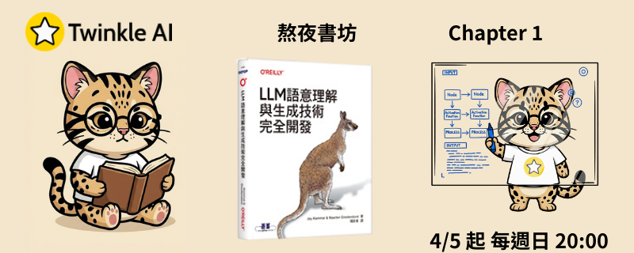

# Chapter 1: 基礎 (Introduction to Language Models)

- **日期：** 2026-04-05
- **內容：** LLM OS 概念、生成式 AI 歷史時間軸、Text input 與 Embeddings 基礎。
- **實作：** 使用 Twinkle AI 專屬模型 `gemma-3-4B-T1-it` 進行 Formosa Vision 專案問答實作。

## 資源

- [簡報](Twinkle-llm-book-ch1.pdf)
- [Notebook](Chapter_1_Introduction_to_Language_Models.ipynb)
- [TwinkleAI 版 Notebook](Chapter_1_Introduction_to_Language_Models_twinkleai_version.ipynb)

## 延伸閱讀

- [A Visual Guide to Gemma 4](https://newsletter.maartengrootendorst.com/p/a-visual-guide-to-gemma-4)

### 書籍相關

- [Hands-On Large Language Models 官網](https://www.llm-book.com/)
- [Hands-On Large Language Models (Official Repo)](https://github.com/HandsOnLLM/Hands-On-Large-Language-Models)
- [Jay Alammar's Blog](https://jalammar.github.io/)
- [Maarten Grootendorst's Newsletter](https://newsletter.maartengrootendorst.com/)
