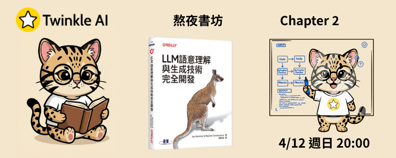

# Chapter 2: Tokens 與 Embeddings (Tokens and Embeddings)

- **日期：** 2026-04-12
- **內容：** Tokenization 解析、Vocabulary 與 Special Tokens、Embeddings 向量魔法。
- **實作：** 深入拆解 Tokenizer 的編碼與解碼過程。

## 本章重點

### Tokenization（分詞）

- 文本必須先經過 tokenized 處理，LLM 才能進行運算
- 四種 tokenization 層級：詞彙（Word）、子詞（Subword）、字元（Character）、位元組（Byte）
- **子詞 Tokenization** 為業界標準（BPE、WordPiece、SentencePiece）— 在詞彙表大小與處理未知詞彙之間取得平衡
- 分詞器行為由三個因素決定：底層演算法、詞彙表大小、訓練資料集

### Embeddings（嵌入向量）

- Token 只是整數 ID，模型需要能捕捉語意的數值表示法 — 即 Embeddings
- **嵌入矩陣（Embedding Matrix）**：每個 token 對應一個向量，隨訓練學習
- **脈絡化詞向量（Contextualized Word Embeddings）**：同一詞在不同語境下有不同向量（如 BERT/DeBERTa）
- **文本嵌入（Text Embeddings）**：整句/整篇文件的向量表示（如 sentence-transformers）

## 資源

- [官方 Notebook](Chapter_2_Tokens_and_Token_Embeddings.ipynb)
- [TwinkleAI 版 Notebook](Chapter_2_Tokens_and_Token_Embeddings-twinkleai.ipynb) — 使用 `twinkle-ai/gemma-3-4B-T1-it`，含中文 prompt 範例、八種模型 Tokenizer 視覺化比較、Word2Vec 音樂推薦實作
- [TwinkleAI 讀書會簡報](Twinkle-llm-book-ch2-slide.pdf) — 29 頁，涵蓋 Tokenization 四層級、Embedding Matrix、脈絡化詞向量，含 3 道測驗題
- [NotebookLM 筆記：Language Blueprints](NotebookLM-Language_Blueprints.pdf) — NotebookLM 生成的 AI 輔助閱讀摘要

## TwinkleAI Notebook 實作內容

| 主題 | 說明 |
| --- | --- |
| 載入 LLM | 使用 `twinkle-ai/gemma-3-4B-T1-it`，示範 tokenize → generate → decode 完整流程 |
| Tokenizer 比較 | BERT (uncased/cased)、GPT-2、Flan-T5、GPT-4、StarCoder2、Galactica、Phi-3、twinkle-ai 八種模型視覺化 |
| 脈絡化詞向量 | 使用 `microsoft/deberta-base` 取得句子中每個 token 的嵌入向量 |
| 文本嵌入 | 使用 `sentence-transformers/all-mpnet-base-v2` 將整句轉為向量 |
| Word2Vec | 使用 GloVe (Wikipedia, 50維) 探索詞向量運算 |
| 音樂推薦 | 以 Word2Vec 訓練播放清單 embeddings，實作以向量相似度推薦歌曲 |
