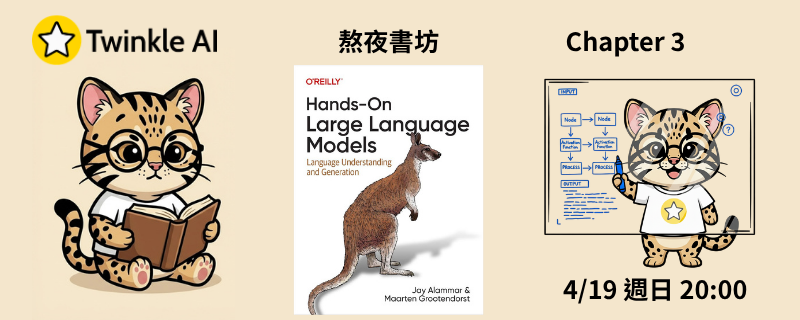

# Chapter 3: 看進語言模型的黑盒子 (Looking Inside Large Language Models)

- **日期：** 2026-04-19
- **內容：** 打開語言模型的黑盒子，透視 Transformer 架構的內部運作機制。
- **實作：** 載入 LLM、逐步拆解自迴歸生成流程，以視覺化方式探索 KV Cache 與注意力機制。

## 本章重點

### 生成機制的秘密

- **自迴歸生成（Autoregressive Generation）**：LLM 每次只預測一個 token，再將該 token 加入輸入，不斷重複直到生成結束符號或達到長度上限
- **Logits 與機率分布**：模型最後一層輸出對應整個詞彙表的分數（logits），經 softmax 轉換為機率分布
- **解碼策略（Decoding / Sampling）**：
  - **Greedy Decoding**：每步選機率最高的 token，快速但缺乏多樣性
  - **Top-k / Top-p (Nucleus) Sampling**：限縮候選集合再隨機取樣，平衡多樣性與連貫性
  - **Temperature**：調整機率分布的「平坦程度」，溫度越高輸出越隨機

### KV Cache 加速技術

- Transformer 在自迴歸推論時，每個新 token 都需要重新計算所有前序 token 的 Key/Value — 計算量隨序列長度線性成長
- **KV Cache** 將已計算過的 Key/Value 向量快取起來，後續生成只需計算新 token 的部分，大幅降低重複運算
- 代價是 GPU 顯存（VRAM）佔用隨序列長度增加，長序列推論的記憶體管理因此成為工程挑戰

### Transformer 內部解密

Transformer 區塊（Block）由兩大核心組件堆疊而成：

#### 前饋神經網路（Feedforward Neural Network, FFN）

- 位於注意力層之後，對每個 token 的表示獨立進行非線性變換
- 負責「記憶」訓練時習得的事實與知識
- 結構通常為：Linear → 激活函數（GELU / SiLU）→ Linear
- 隱藏維度通常是模型維度的 4 倍（如 d_model=4096 → FFN hidden=16384）

#### 注意力機制（Self-Attention Layer）

- 讓每個 token 能「看到」序列中其他 token，整合上下文資訊
- 核心流程：輸入向量分別乘以 **Wq、Wk、Wv** 三組投影矩陣，得到 Query (Q)、Key (K)、Value (V)
- 注意力分數計算：$\text{Attention}(Q, K, V) = \text{softmax}\left(\frac{QK^T}{\sqrt{d_k}}\right)V$
- **多頭注意力（Multi-Head Attention, MHA）**：平行執行多組 Q/K/V 投影，各頭學習不同的語意關係，最後串接輸出

### 注意力機制的進化

| 改良技術 | 說明 |
| --- | --- |
| **Grouped-Query Attention (GQA)** | 多個 Query Head 共享同一組 K/V Head，在推論速度與模型品質之間取得平衡（Llama 2/3 採用） |
| **Flash Attention** | 重新設計注意力的記憶體存取順序，利用 GPU SRAM 減少 HBM 讀寫次數，實現 IO-Aware 的高效實作 |
| **旋轉位置編碼（RoPE）** | 將位置資訊以旋轉矩陣形式注入 Q/K 向量，使模型對相對位置更敏感，且能外推到訓練時未見的序列長度 |

## 資源

- [官方 Notebook](Chapter%203%20-%20Looking%20Inside%20LLMs.ipynb)
- [簡報](Twinkle-llm-book-ch3.pdf)
- TwinkleAI 版 Notebook：（待更新）

## 延伸閱讀

- [The Illustrated Transformer — Jay Alammar](https://jalammar.github.io/illustrated-transformer/)
- [The Illustrated GPT-2 — Jay Alammar](https://jalammar.github.io/illustrated-gpt2/)
- [FlashAttention 論文（2022）](https://arxiv.org/abs/2205.14135)
- [GQA: Training Generalized Multi-Query Transformer Models（2023）](https://arxiv.org/abs/2305.13245)
- [RoFormer: Enhanced Transformer with Rotary Position Embedding](https://arxiv.org/abs/2104.09864)
