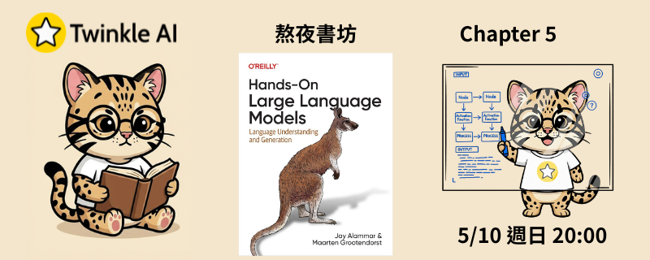

# Chapter 5: 文字聚類與主題建模 (Text Clustering and Topic Modeling)

- **日期：** 2026-05-04
- **內容：** 從嵌入向量到降維、聚類，再到 BERTopic 全模組化框架，探索如何讓模型自動發現文字集合中的隱藏主題結構。
- **實作：** [官方 Notebook](Chapter%205%20-%20Text%20Clustering%20and%20Topic%20Modeling.ipynb)

## 本章重點

### 文字聚類的標準流程

| 步驟 | 技術 | 說明 |
| --- | --- | --- |
| **1. 嵌入文件** | SentenceTransformer | 將每篇文件轉為高維向量（如 384 維） |
| **2. 降低維度** | UMAP | 從高維壓縮至 5 維，保留語意結構以利聚類 |
| **3. 聚類** | HDBSCAN | 密度型聚類演算法，自動找出群數並標記離群點為 -1 |

- **UMAP（Uniform Manifold Approximation and Projection）**：非線性降維方法，比 PCA 更能保留局部語意結構，適合作為聚類前的預處理
- **HDBSCAN（Hierarchical DBSCAN）**：不需預設群數，能自動識別不規則形狀的群體，並將難以歸類的文件標記為雜訊

### BERTopic：模組化主題建模框架

- 將上述三步驟整合為一個端對端框架，並在聚類結果之上自動提取每個主題的代表性關鍵字
- 使用 **c-TF-IDF（class-based TF-IDF）** 計算每個主題中最具代表性的詞彙，而非單純的詞頻統計
- 提供豐富的互動式視覺化工具：文件地圖（Document Map）、主題關聯熱圖（Heatmap）、層次結構樹（Hierarchy）

### 表示模型（Representation Models）

BERTopic 支援插拔式表示模型，可在訓練後更新主題的關鍵字描述：

| 模型 | 特點 |
| --- | --- |
| **KeyBERTInspired** | 利用關鍵字與主題嵌入的相似度，挑選更具語意代表性的詞彙 |
| **Maximal Marginal Relevance (MMR)** | 在相關性與多樣性之間取得平衡，避免關鍵字過度重複 |
| **TextGeneration (Flan-T5)** | 用 Seq2Seq 生成模型根據文件內容與關鍵字自動產生主題標籤 |
| **OpenAI (GPT)** | 透過提示工程讓 GPT 模型生成精準且語意豐富的主題名稱 |

### 資料集：ArXiv NLP 論文

- 使用 HuggingFace 上的 `maartengr/arxiv_nlp` 資料集，包含約 45,000 篇自然語言處理領域論文摘要
- 模型自動發現 155 個主題，涵蓋語音辨識、醫療 NLP、情感分析、機器翻譯、文件摘要等領域

## 資源

- [官方 Notebook](Chapter%205%20-%20Text%20Clustering%20and%20Topic%20Modeling.ipynb)
